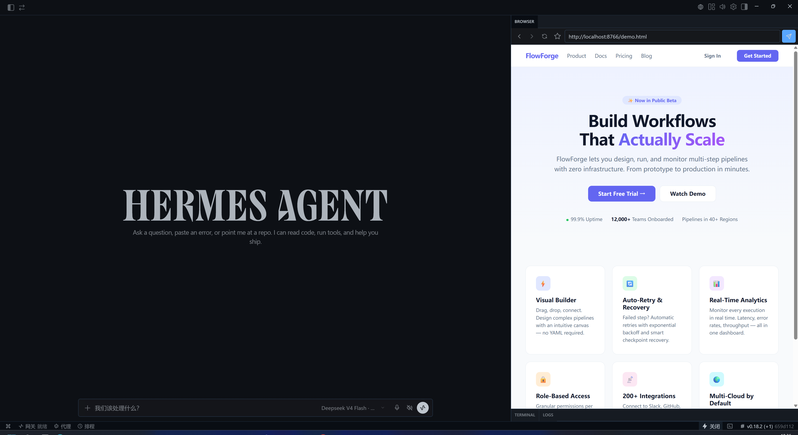

# Web Browser Plugin

> 一个轻量级的嵌入式浏览器面板，作为 Hermes Desktop 插件运行。

在 Hermes Desktop 中直接浏览网页——无需切换窗口。支持后退/前进导航、手动刷新和收藏夹管理。



## 功能

- 🌐 **嵌入式 iframe 浏览器**——在 Hermes 侧栏中直接渲染网页
- 🔙 **后退/前进导航**——维护浏览历史栈
- 🔄 **刷新**——一键重新加载当前页面
- ⭐ **收藏夹**——下拉菜单管理、添加/删除收藏页面，数据持久化到 `ctx.storage`
- ⌨️ **快捷键**——`Ctrl+Shift+B` 切换面板显示
- 📌 **状态栏按钮**——快速显示/隐藏浏览器面板

## 安装

### 前提条件

- [Hermes Agent](https://hermes-agent.nousresearch.com) Desktop 版（插件在 CLI 模式下不可用）

### 安装步骤

```bash
# 克隆仓库
git clone https://github.com/<your-username>/web-browser-plugin.git

# 复制到 Hermes 桌面插件目录
cp -r web-browser-plugin ~/.hermes/desktop-plugins/web-browser-plugin

# 重启插件（或在 Hermes 命令面板中执行 "Reload desktop plugins"）
```

插件会在几秒内自动加载。如果没有出现，在命令面板（`Ctrl+K`）中搜索 **Reload desktop plugins** 并执行。

## 使用

1. 点击 Hermes Desktop 状态栏中的 🌐 图标，或按下 `Ctrl+Shift+B` 打开浏览器面板
2. 在地址栏输入 URL 并回车（或点击发送按钮）
3. 使用工具栏按钮进行后退/前进/刷新操作
4. 点击 ⭐ 将当前页面加入收藏夹

## 项目结构

```
web-browser-plugin/
├── plugin.js      # 插件主文件——纯 ESM JavaScript
├── README.md      # 本文件
└── LICENSE        # MIT 许可证
```

## 开发

插件是纯 ESM JavaScript，无构建步骤。修改 `plugin.js` 后保存即热重载。

### 约定

- 插件 ID：`web-browser-plugin`
- 导出格式：`export default { id, name, register(ctx) }`
- 依赖仅限于 `@hermes/plugin-sdk` 和 `react`

## 许可证

MIT © [你的名字]
